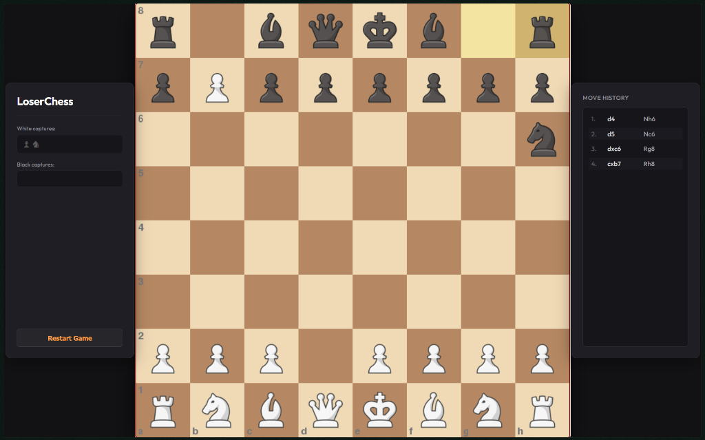

# LoserChess ♟️

**The chess game where the AI actively tries to lose.**



## ❓ What is LoserChess?
LoserChess is a twist on the classic game of chess built with Python and Pygame. Instead of playing the best possible moves, the built-in AI evaluates the board to find the absolute **worst** move it can make. It wants to give away its pieces, walk into checks, and ultimately force you to checkmate it. 

## ✨ Features
* **Anti-Stockfish AI:** A custom evaluation function that prioritizes self-destruction, piece blunders, and moving into mating nets.
* **Interactive GUI:** Fully playable graphical interface built with Pygame featuring drag-and-drop mechanics.
* **Legal Move Highlighting:** Click any piece to see its valid target squares.
* **Rules Enforcement:** Powered by `python-chess` to handle all complex chess logic (en passant, castling, promotion, and draw conditions).

## 🚀 Installation & Setup

1. **Clone the repository:**
   ```bash
   git clone [https://github.com/MohinVinayak/LoserChess.git](https://github.com/MohinVinayak/LoserChess.git)
   cd LoserChess
   ```

2. **Install the required dependencies:**
   Make sure you have Python installed, then run:
   ```bash
   pip install pygame chess
   ```

3. **Run the game:**
   ```bash
   python main.py
   ```

## 🛠️ How the "Losing" AI Works
Standard chess engines evaluate a board and try to maximize their score. LoserChess reverses this logic. When it evaluates legal moves, it looks for outcomes that result in a drastically lower score for itself. 
* It actively penalizes moves that capture your pieces.
* It actively rewards moves where you can capture its pieces on the next turn.
* If it sees a move that allows you to checkmate it, it will immediately play it.

## 📝 License
This project is open source and available under the MIT License.